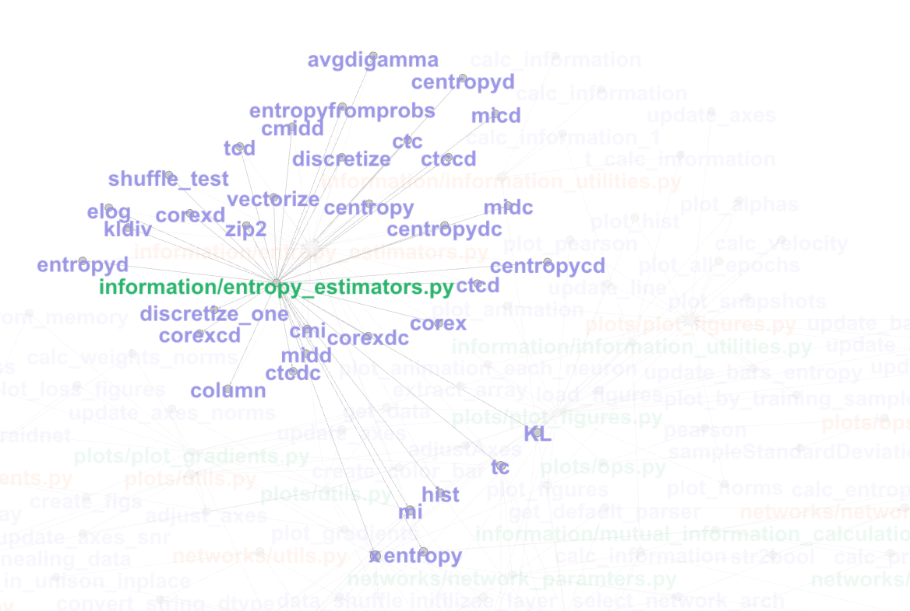

This is an attempt to visualize the functions' defining and calling relationship with files.

To construct the graph, I wrote a python script,then used gephi to visualize it.

orange nodes are those files defining functions respectively.
green nodes are those files calling functions.

